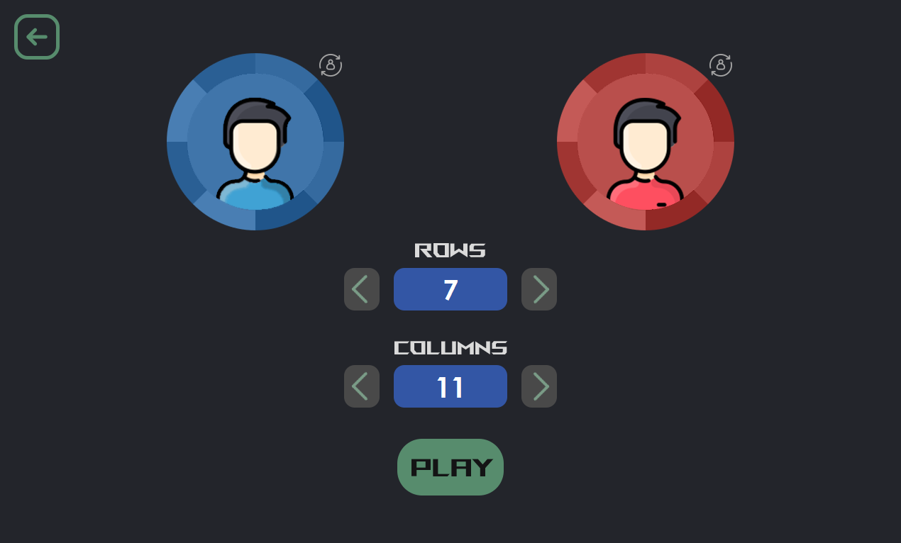
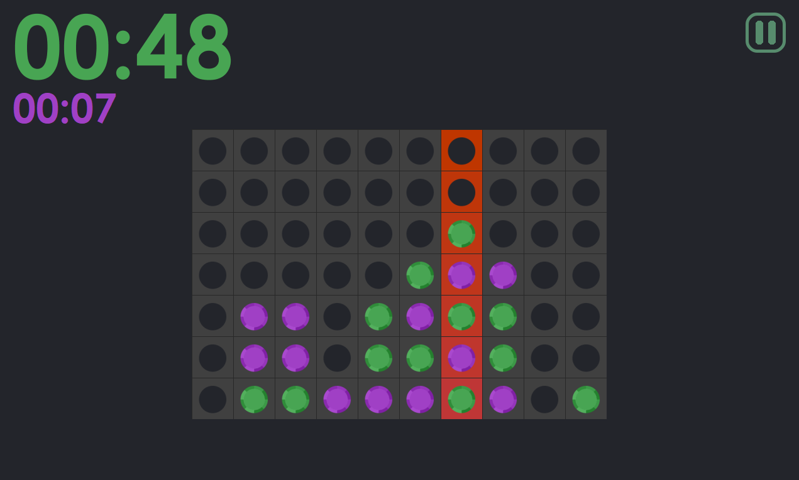

# Quadline
<a href="https://github.com/salo368/Quadline/blob/main/README_Spa.md">(Versión español)</a>

Connect four game made in Java

Quadline is a project that allows playing and visualizing the game of connecting 4 tokens using a grid. This project is developed in Java with Java Swing and features an interactive interface for players to select cells and connect their tokens. The objective of the game is to connect four tokens of the same color in a straight line, either horizontally, vertically, or diagonally. The project implements the game logic and provides a smooth and enjoyable experience.

## Features

- Graphical user interface with a grid-based game board.
- Player interactions through mouse clicks on the grid cells.
- Game logic for connecting four tokens of the same color in a straight line.
- Support for horizontal, vertical, and diagonal connections.

## Visuals

Here are some visuals that illustrate the interface and game in action:

Game features menu:

Game in action:

## System Requirements

- Java (version 1.8.0_241)

## How to Use

1. Clone this repository: `git clone https://github.com/salo368/Quadline.git`
2. Open the project in your preferred Java development environment, such as NetBeans.
3. Run the main class of the game, which contains the `main` method.
4. A game window will open with the start screen.
5. Enjoy the game and have fun!

---

Thank you for your interest in the Quadline project! If you have any questions or need further information, feel free to contact me.
