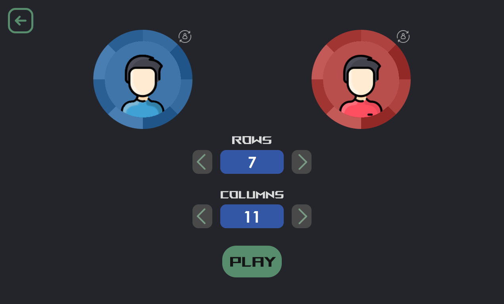
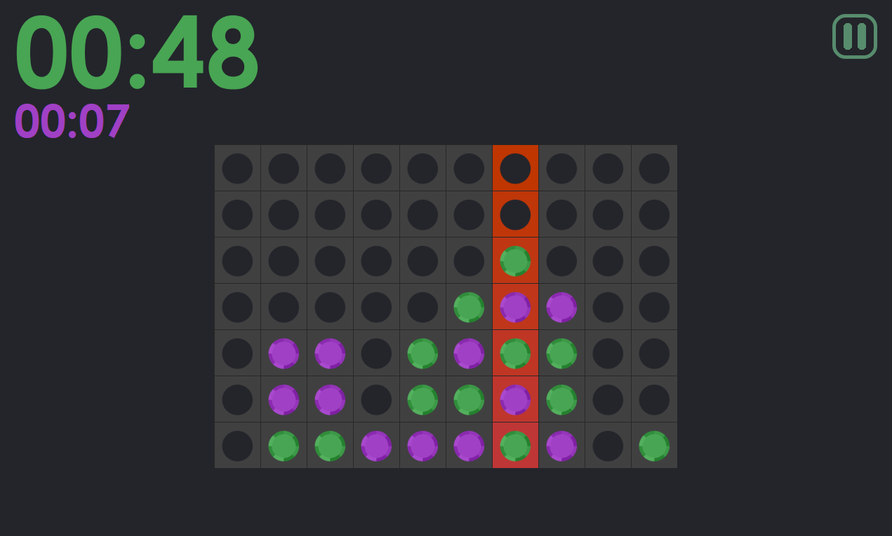

# Quadline
Juego de connect 4 hecho en Java

Quadline es un proyecto que permite jugar y visualizar el juego de connect 4 utilizando una cuadrícula. Este proyecto está desarrollado en Java con Java Swing y cuenta con una interfaz interactiva para que los jugadores seleccionen celdas y conecten sus fichas. El objetivo del juego es conectar cuatro fichas del mismo color en línea recta, ya sea horizontalmente, verticalmente o en diagonal. El proyecto implementa la lógica del juego y proporciona una experiencia suave y divertida.

## Características

- Interfaz gráfica con un tablero de juego basado en una cuadrícula.
- Interacciones de los jugadores a través de clics del mouse en las celdas de la cuadrícula.
- Lógica de juego para conectar cuatro fichas del mismo color en línea recta.
- Soporte para conexiones horizontales, verticales y diagonales.

## Visuales

Aquí tienes algunas imágenes que ilustran la interfaz y el juego en acción:

Menú de características del juego:

Juego en acción:

## Requisitos del Sistema

- Java (versión 1.8.0_241)

## Cómo Utilizarlo

1. Clona este repositorio: `git clone https://github.com/salo368/Quadline.git`
2. Abre el proyecto en tu entorno de desarrollo de Java preferido, como NetBeans.
3. Ejecuta la clase principal del juego, que contiene el método `main`.
4. Se abrirá una ventana de juego con la pantalla de inicio.
5. ¡Disfruta del juego y diviértete!

---

¡Gracias por tu interés en el proyecto Quadline! Si tienes alguna pregunta o necesitas más información, no dudes en contactarme.
